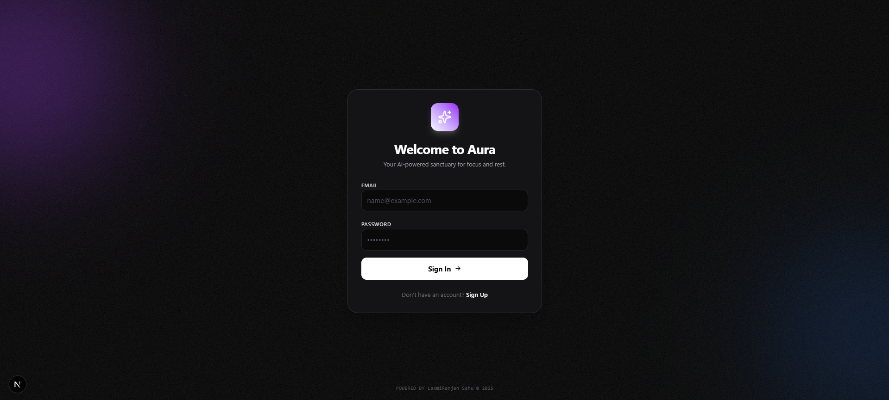
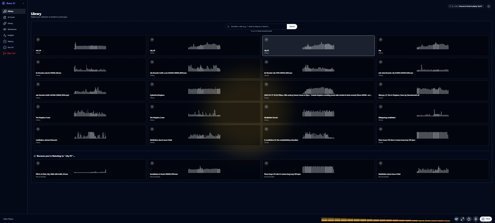
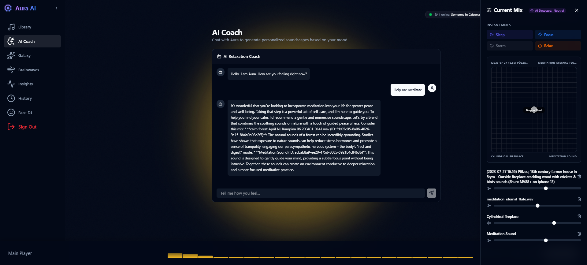
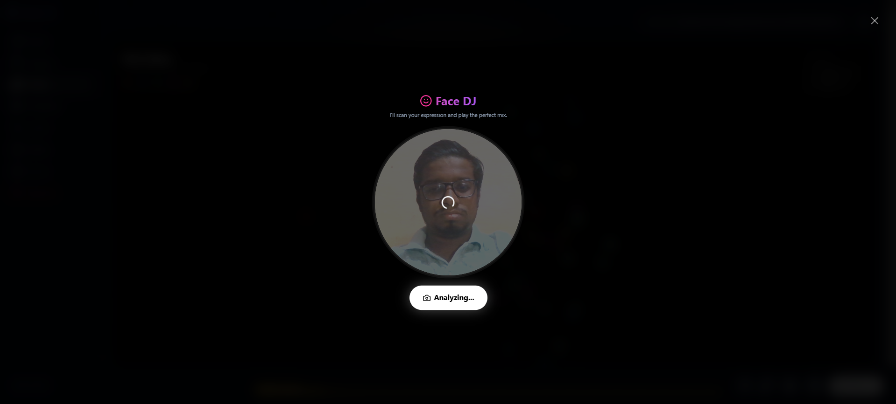
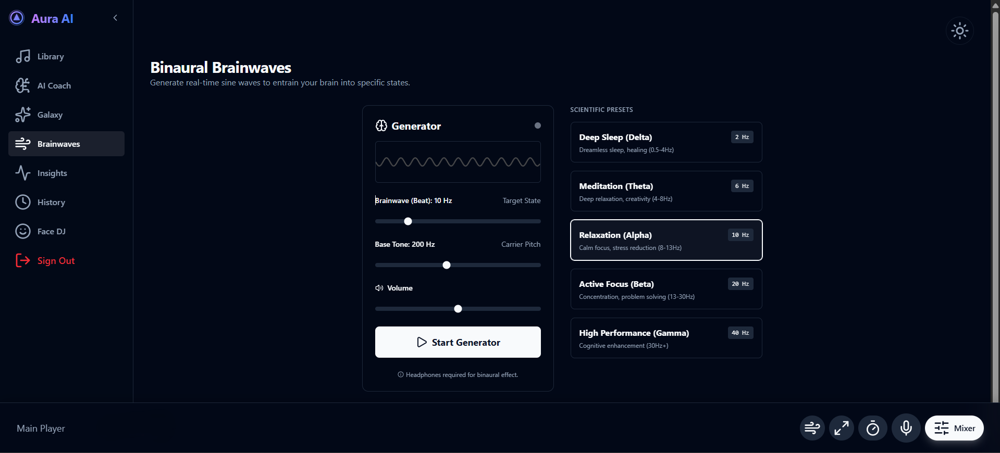
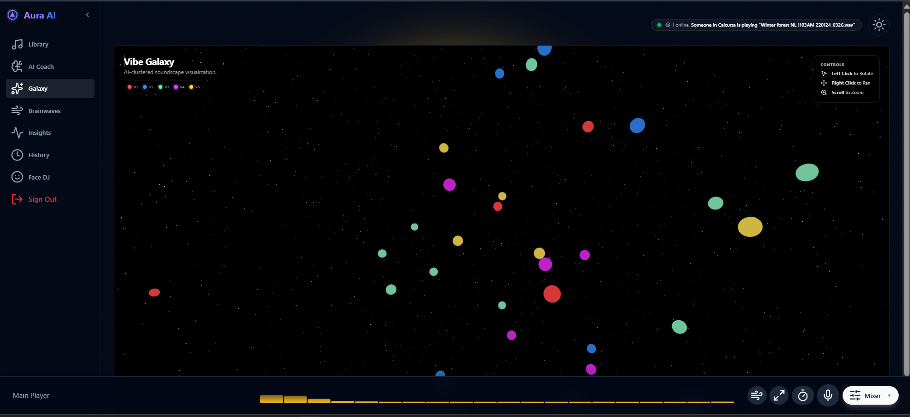

# Aura AI: Frontend Experience 🎨

> **The Interactive Interface for the Aura Intelligent Audio Platform.**

Aura AI is a modern, responsive web application built with **Next.js 16** and **React**. It provides a seamless interface for users to interact with the Aura ML Brain, exploring sounds, visualizing audio, and experiencing the multimodal "Face DJ" feature.

## ✨ Key Features

### 🌊 Immersive Sound Library
Browse and play a vast collection of high-fidelity environmental sounds, from "Cozy Rain" to "Deep Space".

### 😊 Face DJ
(Experimental) A webcam-based interface that scans your facial expressions and generates a matching soundscape in real-time using the Aura ML emotion recognition pipeline.

### 🧠 Binaural Brainwaves
Generate real-time binaural beats (Sine waves) to entrain your brain into specific states:
- **Delta (0.5-4Hz)**: Deep Sleep
- **Theta (4-8Hz)**: Meditation & Creativity
- **Alpha (8-13Hz)**: Relaxation
- **Beta (13-30Hz)**: Active Focus

### 🎛️ Sound Mixer
Create your perfect atmosphere by layering up to 4 different sounds.
- **Volume Control**: Adjust levels for each track independently.
- **Surprise Me**: Let AI generate a random harmonious mix for you.
- **Save Mix**: (Coming Soon) Save your favorite combinations.

### 🧘 Zen Mode & Breathwork
- **Zen Mode**: Toggle a distraction-free UI to focus solely on the audio.
- **Breathwork**: Access guided breathing exercises (e.g., 4-7-8 technique) directly within the app to reduce anxiety.

### 🎙️ Voice Control
Navigate the app hands-free. Use commands like *"Play Rain"*, *"Stop"*, or *"Start Meditation"* to control your experience without touching the screen.

### ⏱️ Smart Timer
Set a sleep or focus timer to automatically fade out audio after a set duration, perfect for bedtime routines.

### 🔍 Semantic Search
Find sounds using natural language (e.g., "sounds for studying" or "cozy rain") via our Vector Search engine.

### 🔒 Admin Sound Upload
Upload new sounds to the platform directly from the UI.
> **Note**: This feature is restricted to the Admin Email configured in the code.
- **Access**: Only authorized emails can see the "Upload" button.
- **Path**: `src/components/features/sound-library/SoundLibrary.tsx`

### 📊 Audio Visualization
Real-time waveform rendering of playing tracks using the Web Audio API and Canvas.

## ⚙️ Configuration

To enable **Admin Features** (like uploading sounds), you must add your email to the allowlist in the code:

1.  Open `src/components/features/sound-library/SoundLibrary.tsx`
2.  Find the `ADMIN_EMAIL` constant:
    ```typescript
    const ADMIN_EMAIL = "your-email@gmail.com"
    ```
3.  Replace it with your email address.
    *(Also check `src/app/(main)/layout.tsx` for sidebar visibility settings)*

## 🛠️ Tech Stack

- **Framework**: [Next.js 16](https://nextjs.org/) (App Router)
- **Language**: TypeScript
- **Styling**: [TailwindCSS](https://tailwindcss.com/) + CSS Variables
- **Icons**: Lucide React
- **State Management**: React Hooks (Context API)
- **API Integration**: Axios / Native Fetch
- **Visuals**: Canvas API for Waveforms

## 🚀 Getting Started

### Prerequisites
- Node.js 18+
- npm or yarn
- The **Aura ML Backend** running on port `8000` (see `../aura-ml/README.md`)

### Installation

1.  **Install dependencies:**
    ```bash
    npm install
    # or
    yarn install
    ```

2.  **Configure Environment:**
    Ensure you have the valid `.env.local` (if required by specific features, though defaults often work for dev).

3.  **Run the Development Server:**
    ```bash
    npm run dev
    ```

4.  **Open the App:**
    Visit `http://localhost:3000` in your browser.

## 📂 Project Structure

```bash
aura-ai/
├── src/
│   ├── app/                    # Next.js App Router (Routing & Layouts)
│   │   ├── (auth)/             # Authentication Routes (Login/Register)
│   │   ├── (main)/             # Main Application Routes (Protected)
│   │   │   ├── layout.tsx      # Main Dashboard Layout
│   │   │   └── page.tsx        # Home Page
│   │   ├── api/                # Next.js API Routes (Server-side Proxy)
│   │   └── globals.css         # Global Styles & Tailwind Directives
│   ├── components/
│   │   ├── features/           # Feature-Specific Components (15+ Modules)
│   │   │   ├── ai-coach/       # Intelligent Assistant
│   │   │   ├── audio-player/   # Global Player Controls
│   │   │   ├── binaural-beats/ # Brainwave Entrainment
│   │   │   ├── breathwork/     # Guided Breathing Exercises
│   │   │   ├── face-dj/        # Emotion-based Music generation
│   │   │   ├── galaxy/         # 3D Visualizer
│   │   │   ├── guide/          # User Onboarding
│   │   │   ├── shortcuts/      # Keyboard Shortcuts
│   │   │   ├── social/         # Social Sharing Support
│   │   │   ├── sound-library/  # Discovery Grid
│   │   │   ├── sound-mixer/    # Multi-track Mixer
│   │   │   ├── system/         # System Utilities
│   │   │   ├── theme/          # Feature-level Theme Logic
│   │   │   ├── voice-control/  # Voice Command Interface
│   │   │   └── zen-mode/       # Distraction-free Mode
│   │   ├── theme/              # Global Theme Provider & Toggles
│   │   ├── ui/                 # Reusable Radix/Shadcn Components
│   │   └── shared/             # Layout Shell (Sibebar, Header)
│   ├── lib/                    # Core Business Logic & Utilities
│   │   ├── api-client/         # Axios/Fetch Wrappers
│   │   ├── supabase/           # Database Configuration
│   │   ├── audio/              # Audio Engine
│   │   └── ...
│   ├── store/                  # Global State (Zustand)
│   └── ...
├── public/                     # Static Assets (Images, Icons)
├── .env.local                  # Environment Variables (Secrets)
├── next.config.ts              # Next.js Configuration
├── tailwind.config.ts          # Tailwind Styling Config
└── ...
```

## 📸 Screenshots

> *Please add your screenshots to the `assets/screenshots` folder with the names below.*

### 1. Login Screen


### 2. Dashboard


### 3. AI Coach Interface


### 4. Face DJ Experience


### 5. Brainwaves Mode


### 6. Galaxy Visualizer

